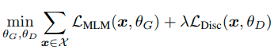

# Why Is BERT Training Inefficient?
- [BERT = Bidirectional Encoder Representations from Transformers](https://arxiv.org/pdf/1810.04805.pdf)
- uses unsupervised pre-training
- encodes text into WordPiece tokens 
- pre-training replaces 15% inputs with "[MASK]" token,
- then predicts original token ids based on context
- every step costs me,
- but only a few tokens can be masked this way!

# How To Improve?
- hard targets for all tokens?
- [Electra paper @ Stanford & Google Brain @ ICRL 2020, Not SoTA](https://openreview.net/pdf?id=r1xMH1BtvB)
- smaller generator and big discriminator
- train big model
- smaller generator is jointly trained
- the generator is trained with masked language modeling (MLM) 
- for masked positions generator samples tokens
- these corrupted tokens are detected by the big model
- true or fake token?
 
 

# Specifics
- generator and discriminator same architecture
- only embeddings are shared
  - sharing more was not helping
- generator has 4x - 2x less layers
- trained jointly otherwise discriminator fails to learn
- Weight sharing only embeddings or tokens and positional.
- Generator 2x - 4x smaller
  - bigger are not helping
  - compute more expensive
  - perhaps otherwise too difficult task
  

# Results
- Datasets:
  - GLUE: natural understanding benchmark
  - SQuAD: questions answering benchmark
- RoBERTa = BERT with better training and dataset
  - longer training, bigger batches, more data
  - remove next sentence objective
  - train on longer sequences
  - dynamically changing masking pattern
- XLNet = BERT with permutation language modelling
  - maximizes likelihood of the original sequence
  - compared to all other permutations
  - next-token prediction task

# Source of The Improvement
- compared alternative tasks on GLUE score

<table class="table">
  <thead>
    <tr><th>Task</th><th>Description</th><th>GLUE score</th></tr>
  </thead>
  <tbody>
    <tr><td>BERT</td><td>MLM with [MASK] token</td><td>82.2</td></tr>
    <tr><td>Replace MLM</td><td>masked tokens replaced with generated + LM</td><td>82.4</td></tr>
    <tr><td>Electra 15%</td><td>Discriminator over 15% of the tokens</td><td>82.4</td></tr>
    <tr><td>All-Tokens MLM</td><td>Replace MLM on all tokens + copy mechanism</td><td>84.3</td></tr>
    <tr><td>Electra</td><td>Discriminator over all tokens</td><td>85.0</td></tr>
  </tbody>
</table>

- Speculations:
  - loss over all inputs is important
  - masking causes pre-train to fine-tune mismatch
  - personally: some similarity to gradient boosting

# Follow up - MC-BERT
- [MC-BERT Paper](https://arxiv.org/pdf/2006.05744.pdf)
- Contrastive instead of discriminative
- shares
 

# Follow Up - TEAMS
- also contrastive
- shares more weights

