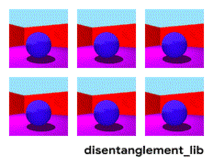
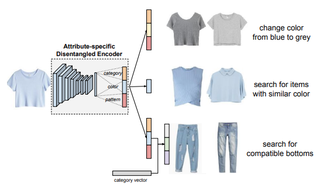
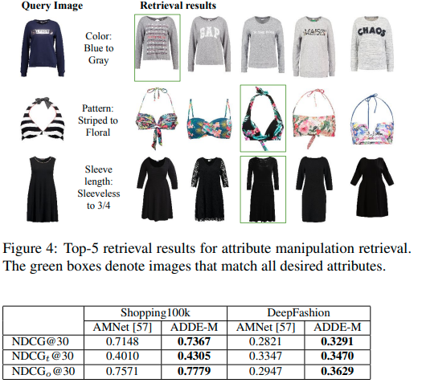
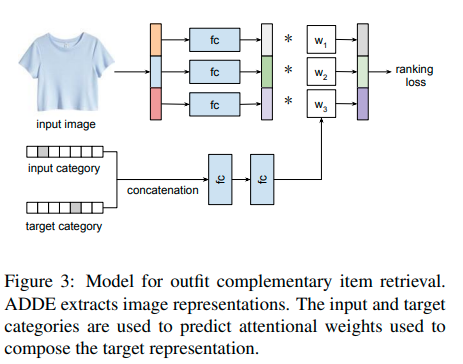

# Why Disentangled
- attribute manipulation, conditional similirity e.g. the same with different change color
- complementary item e.g. complete fashion outfit

# What is disentangled
- Goal change 
- Entangled representation = hard to to preserve some attributes and change others
- Disentangled: Attibutes have separate dimensions applied to them of there is known orthogonality

# Unsupervised Disentangling Methods
- Variational Auto-encoders
  - speculation:
    - some disentanglement thanks to the architecture
    - compressing into low-dimension and small-space
    - high-level factors only
    - similar in high level factors are encoded close to each other
  - methods: mutual information between latents, total correlation e.g. unsupervised [Relevance factors VAE](https://arxiv.org/pdf/1902.01568v1.pdf)
- GANs (has encoder and decoder) e.g. [DNA-GAN: Learning Disentangled Representations from Multi-Attribute Images](https://arxiv.org/pdf/1711.05415.pdf),
- Flow-Based models e.g. [Glow](/ml/openais-glow-flow-based-model-teardown)
  - ~VAE where decoder = reverse of encoder
  - reversibly encodes into independent gaussian factors

# Unsupervised Disentangled Representations
- Google 2019 paper [Challenging Common Assumptions in the Unsupervised Learning of Disentangled Representations](https://ai.googleblog.com/2019/04/evaluating-unsupervised-learning-of.html)
- a large-scale evaluation of various unsupervised methods (12k models)
- On dataset Shape3D try to separate all attributes of the scene into 10 dimensions 
- No model disentangled reliably
- theorem assumptions about the data have to be incorporated into the model (inductive bias)
- so each unsupervised model needs to be at least specialized to some type of data
 

# Attribute-driven Disentangled Representations

- Amazon 2021 paper [Learning Attribute-driven Disentangled Representations for Interactive Fashion Retrieval](https://openaccess.thecvf.com/content/ICCV2021/papers/Hou_Learning_Attribute-Driven_Disentangled_Representations_for_Interactive_Fashion_Retrieval_ICCV_2021_paper.pdf)
- SoTA on the fashion tasks
- supervised disentangled represantions learning
  - all attribute values are of fixed count
  - multi-task training
  - store prototype embeddings of each attribute value in memory module
  - prototypes can then be swapped for items attribute vector

## Architecture

- image representation (?which)
- per attribute:
  - fully-connected two-layer network
  - map into attributed-specific subspace
  - producing image's attribute embedding
- together it is disentangled representation
- called Attribute-Driven Disentangled Encoder (ADDE)
- memory block
  - stores prototype embeddings for all values of the attributes
  - e.g. each color has one prototype embeddings
  - stored in a matrix that forces small non-block diagonal elements
  - trained via triplet loss
  - Why we cannot extract these from the classifier - not the same dimension or reprez?

## Loss
- Label triplet loss
  - representations with same labels to have same vectors
- Consistency triplet loss
  - attribute representations of an image close to corresponding memory vectors
  - align prototype embeddings with representations
- Compositional triplet loss
  - generate change in attributes
  - create manipulation vector using prototype vectors
  - sample positive and negative samples based on labels
- Memory block loss
  - off-block-diagonal to zero

## Experiments and Results

### Attribute Manipulation Retrieval
- Previous approaches
  - AMNet: [Memory-Augmented Attribute Manipulation Networks for Interactive Fashion Search](https://openaccess.thecvf.com/content_cvpr_2017/papers/Zhao_Memory-Augmented_Attribute_Manipulation_CVPR_2017_paper.pdf)
    - no disentangling
    - target attribute value is represented by a prototype vector 
    - specialized NN layer fuses the prototype vector attribute into the representation
  - FSN: [Learning attribute representations with localization for flexible fashion search](https://openaccess.thecvf.com/content_cvpr_2018/papers/Ak_Learning_Attribute_Representations_CVPR_2018_paper.pdf)
    - localizes regions of attributes within the image
    - using attribute activation maps
    - then weighted-pooling on earlier convolution layer (5 instead of 7)
- AlexNet backbone network for comparable results
- Loss function ablations included

### Complete Outfit
- backbone network Resnet18

