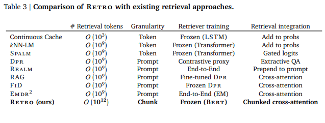
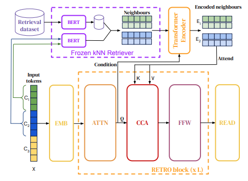

# DeepMind's Retrieval Transformer
- Autoregressive language modeled
- conditions on document chunks
- retrieved based on similarity with preceding tokens
- SoTA on Wikitext103 and the Pile 
- Competitive on QA same perf GPT-3 with 25x less params
- model performs even when low train-test overlap
- ablations show retrieval helps
- retrieval reduces hallucinations and increases interpretability
- [Paper](https://arxiv.org/pdf/2112.04426v1.pdf), [Deep Mind Blog](https://deepmind.com/research/publications/2021/improving-language-models-by-retrieving-from-trillions-of-tokens)

# Other Retrieval Architectures
- historically inverted index matching [TF-IDF](https://en.wikipedia.org/wiki/Tf%E2%80%93idf) and BM25
- latent topic modelling e.g. [LDA (2003)](https://www.jmlr.org/papers/volume3/blei03a/blei03a.pdf)
- [edit-distance search for translation](https://arxiv.org/pdf/1705.07267.pdf)
- [kNN-LM](https://openreview.net/forum?id=HklBjCEKvH)
  - search context LM embedding in database
  - linearly interpolate with LM predictions
- [DPR](https://aclanthology.org/2020.emnlp-main.550.pdf)
  - trains one [Bert](https://arxiv.org/pdf/1706.03762.pdf) for keys and one for values
  - uses contrastive loss
- Retro in contrast uses
  - longer sequences
  - cross-attention allowing for multiple retrievals
  - bigger memory

# General Cross Attention
- Let us have sequence A and sequence B
- Attention matrix from sequence A is used to highlight in sequence B
- Queries from sequence A
- Keys and Values from another sequence B
- Similar [the feed forward layer](/ml/Feed-Forward-Self-Attendion-Key-Value-Memory)
- sequences A and B lengths can differ

# Training Dataset
- multilingual MassiveText
- SentencePiece tokenizer vocabulary of 128k tokens
- Retrieval database 1.75T tokens of text
- Chucks are consecutive 64 token sequences
- not retrieval from the same document during training

 
# Architecture
- Frozen BERT retriever on chunk level
- differentiable encoder conditioned on query
- chunked cross-attention with previous chunk retrieval set 

# Retriever
- database is key-value memory
- frozen BERT vectorizes the chunks
- values are two consecutive chunks
- keys are the first chunk
- 2T db queried in 10ms
- retrieval is part of the input dataset pipeline

# Encoding Retrieved Neighbours
- all retrieved values
- are first passed through an encoder
- differentiably modulates retrieved chunks
- using cross attention to query chunks hidden representation
  - at the last layer before first cross-attention
- output is called retrieval set

# Chunked Cross Attention
- take previous chunk retrieval set to be autoregressive
- add relative positional encodings to each retrieved 
- concatenate into time dimension
- use hidden representation at the layer as query
- cross-attend 

