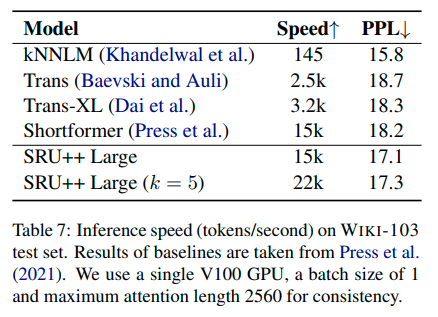




Here are my notes on SRU, and thanks to the paper authors and [Yannic's Discord meetup discussions](https://discord.com/channels/714501525455634453/780793106496880650/941342791349440514).


## Summary:
- Language modelling:
  - input: text, output masked token or next token
- SRU
  - [Simple Recurrent Units for Highly Parallelizable Recurrence](https://arxiv.org/pdf/1709.02755.pdf), [OpenReview](https://openreview.net/forum?id=rJBiunlAW)
  - is RNN, 10x faster than LSTM
  - simple and parallelizable
- SRU++
  - combines Self-Attention and SRU
  - 3x - 10x faster training
  - competitive with Transformer on enwik8
- [Terraformer](https://arxiv.org/pdf/2111.12763.pdf) =
  - [Sparse is Enough in Scaling Transformers](https://arxiv.org/pdf/2111.12763.pdf)
  - is SRU + sparcity + many tricks
  - 37x faster decoding speed than Transformer


### Attention and Recurrence
- attention vs recurrence = graph vs sequence
- attention connects across entire sequence as fully connected graph
- recurrence keeps information from previous states in a state vector 
- [original recurrent LSTM](https://www.bioinf.jku.at/publications/older/2604.pdf) is less parallelizable than [Transformer](https://arxiv.org/pdf/1706.03762v5.pdf)
  - future steps in LSTM depend on the past and is not parallelizable
- ? vizualization

  
### How SRU helps parallelization?
- while the state computation of SRU is time-dependent, each state dimension is independent
- time step: \\( t \\), input vector: \\( x_t \\), (inner) state \\( c_t \\)
- (inner) forget gate \\( f_t := \sigma(W_f x_t + V_f c_{t-1} + b_f) \\)
  - problem: both \\( c_t, f_t \\) depend on all dimensions \\( c_{t-1} \\) 
  - due to matrix-multiplication: \\( V_f c_{t-1} \\)
  - solution: pointwise (Hadamard) multiplication \\( v_f \odot c_{t-1} \\)
  - gives parallel computation \\( c_t, f_t \\)
- state \\( c_t := f_t \odot c_{t-1} + (1 - f_t) \odot W x_t \\)
- all \\( W, V, b \\) are trained

### Highway Network Component
- [highway network](https://arxiv.org/pdf/1507.06228.pdf) more dynamic than a skip connection 
  - provides regulated gradient flow
- reset gate weights output skip connection
  - defined as \\( r_t := \sigma( W_r x_t + v_r \odot c_{t-1} + b_r ) \\)
  - combines the state with the input
  - then used for output \\( h_t \\) that allows gradient flow
- output (hidden) vector: \\( h_t := r_t \odot c_t + (1 - r_t) \odot x_t \\)


### All Equations
- \\( f_t := \sigma( W_f x_t + v_f \odot c_{t-1} + b_f) \\)
- \\( r_t : = \sigma( W_r x_t + v_r \odot c_{t-1} + b_r ) \\)
- \\( c_t := f_t \odot c_{t-1} + (1-f_t) \odot (W x_t) \\)
- \\( h_t : = r_t \odot c_t + (1-r_t) \odot x_t \\)
 
Can also decompose into primitives:
- \\( \mathrm{Way}(a, b, g, W) := g \odot a + (1 - g) \odot (W b) \\)
- \\( \mathrm{Gate}(a, b, W, v, w) := \sigma(W b + v \odot a + w) \\)


### Similarity to LSTM
- equations are similar to LSTM
- but output gate, input gate are replaced with reset gate
  - highway network
- SRU equations:
  - \\( f_t := \sigma( W_f x_t + v_f \odot c_{t-1} + b_f) \\)
  - \\( r_t : = \sigma( W_r x_t + v_r \odot c_{t-1} + b_r ) \\)
  - \\( c_t := f_t \odot c_{t-1} + (1-f_t) \odot (W x_t) \\)
  - \\( h_t : = r_t \odot c_t + (1-r_t) \odot x_t \\)
 
- LSTM equations:
  - \\( f_t = \sigma_g (W_f x_t + U_f c_{t-1} + b_f ) \\)
  - \\( i_t = \sigma_g (W_i x_t + U_i c_{t-1} + b_i ) \\)
  - \\( o_t = \sigma_g (W_o x_t + U_o c_{t-1} + b_o ) \\)
  - \\( c_t = f_t \odot c_{t-1} + i_t \odot \sigma_c (W_c x_t + b_c) \\)
  - \\( h_t = o_t \odot \sigma_h(c_t) \\)


### GPU vs CPU
Comparison of GPU and CPU from Nvidia documentation.


### CUDA kernels
- [CUDA kernels](https://docs.nvidia.com/cuda/cuda-c-programming-guide/index.html) are C++ functions executed N times by N CUDA threads
 
```
// Kernel definition
__global__ void VecAdd(float* A, float* B, float* C)
{
    int i = threadIdx.x;
    C[i] = A[i] + B[i];
}

int main()
{
    ...
    // Kernel invocation with N threads
    VecAdd<<<1, N>>>(A, B, C);
    ...
}
```


### Parallel Implementation
- single matrix multiplication \\( U = (W, W_f, W_r) x_t \\)
- point-wise operations are in [a single fused CUDA kernel](https://github.com/taolei87/sru/blob/master/sru/csrc/sru_cuda_kernel.cu)
- and parallelize across each hidden state dimension
- computation still sequential in time dimension
- complexity O(L · B · d)

### SRU Results
- On its own SRU slightly outperforms to QRNN
- both SRU and QRNN similar speed
- 5 - 9x speed-up over cuDNN-optimized LSTM on classification and question answering datasets
- both ~10x faster than LSTM


### SRU and Transformer results

- Transformer + SRU outperforms vanilla
- ? architecture - how does it look


## SRU++: Attention with SRU
- [When Attention Meets Fast Recurrence: Training Language Models with Reduced Compute](https://arxiv.org/abs/2102.12459)
- combines Self-Attention and SRU
- competitive on enwik8, wiki-103, Billion Word datasets
- much less attention blocks needed
- 3x - 10x faster training than Transformer-XL
  - 1.6 days on 8-GPU machine


### SRU++ Layer
- SRU++ is SRU with self-attention instead of \\( (W, W_f, W_r) x \\)
- Attention
  - no positional encodings
  - operates on dim 512 instead of 2048 "projection trick"
  - residual connection both on attention and SRU
  - layer normalization after attention block
- attention help significantly
  - but needed only in every k-th layer e.g. every 5th


 

### Datasets
#### ENWIK8 (Hutter, 2006)
- is a character-level language modeling dataset consisting of 100M tokens taken from Wikipedia.
- The vocabulary size of this dataset about 200k.
- BPC is bits per character

#### WIKI-103 (Merity et al., 2017)
- is a wordlevel language modeling dataset.
- 100M tokens extracted from Wikipedia
- vocabulary of 260K tokens

### Results
- attention helps the most in the last layers
  - maybe first layers learn local features
  - which attention then uses

- outperforms Transformer-XL baseline by -3% BPC
- if larger context, then even lower BPC


- 1 attention-SRU every 10 layers


- maximum perfromance comparison
- larger model d = 3072, base model 4096
- context length train = 1024, eval 3072 
- SoTA enwik8, but not 


- On par with Compressive memory, worse than kNN-LM, Routing Transformer





