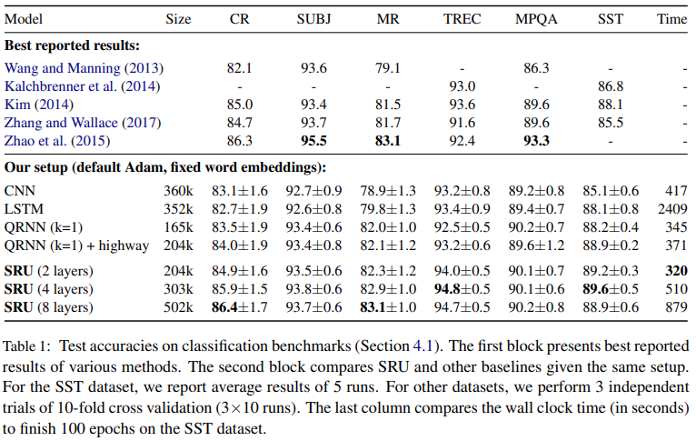
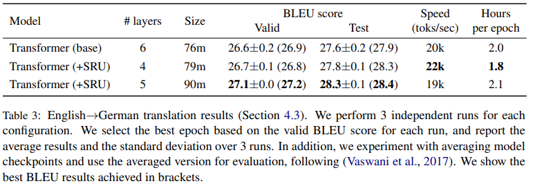




Here are my notes on SRU, and thanks to the paper authors and [Yannic's Discord meetup discussions](https://discord.com/channels/714501525455634453/780793106496880650/941342791349440514).

# Summary:
- SRU = RNN, 10x faster than LSTM
- SRU++ =
  - combines Self-Attention and SRU
  - 3x - 10x faster training
  - enwik8, wiki-103
- Terraformer =
  - SRU + sparcity + many tricks
  - 37x faster decoding speed

# Simple Recurrent Unit (SRU) 
- [Simple Recurrent Units for Highly Parallelizable Recurrence](https://arxiv.org/abs/1709.02755)
  - [OpenReview (Training RNNs as Fast as CNNs)](https://openreview.net/forum?id=rJBiunlAW)
- [Sparse is Enough in Scaling Transformers](https://arxiv.org/pdf/2111.12763.pdf)


## Attention and Recurrence
- attention vs recurrence = graph vs sequence
- [original recurrent LSTM](https://www.bioinf.jku.at/publications/older/2604.pdf) is less parallelizable than [Transformer](https://arxiv.org/pdf/1706.03762v5.pdf)
  - because future steps in LSTM depend on the past?
 
  
## How SRU helps parallelization?
- while the state computation of SRU is time-dependent, each state dimension is independent
- time step: \\( t \\), input vector: \\( x_t \\), (inner) forget gate \\( f_t \\)
- typically: \\( f_t := \sigma(W_f x_t + V_f c_{t-1} + b_f) \\)
  - problem: both \\( c_t, f_t \\) depend on all dimensions \\( c_{t-1} \\) 
  - due to matrix-multiplication: \\( V_f c_{t-1} \\)
  - solution: point-wise multiplication \\( v_f \odot c_{t-1} \\)
  - gives parallel computation \\( c_t, f_t \\)
- state \\( c_t := f_t \odot c_{t-1} + (1 - f_t) \odot W x_t \\)


# Highway Network Component
- [highway network](https://arxiv.org/pdf/1507.06228.pdf) more dynamic than a skip connection 
  - provides regulated gradient flow
- reset gate weights output skip connection
  - defined as \\( r_t := \sigma( W_r x_t + v_r \odot c_{t-1} + b_r ) \\)
  - combines the state with the input
  - then used for output \\( h_t \\) that allows gradient flow
- output (hidden) vector: \\( h_t := r_t \odot c_t + (1 - r_t) \odot x_t \\)


# All Equations
Using two primitives:
- \\( Way(a, b, g, W) := g \odot a + (1 - g) \odot (W b) \\)
- \\( Gate(a, b, W, v, w) := \sigma(W b + v \odot a + w) \\)
 
We can rewrite:
- \\( f_t := Gate(x_t, c_{t-1}, W_f, v_f, b_f) \\)
- \\( c_t : = Way(x_t, c_{t-1}, f_t, W) \\)
- \\( r_t := Gate(x_t, c_{t-1}, W_r, v_r, b_r) \\)
- \\( h_t : = Way(x_t, c_t, r_t, 1) \\)


# CUDA kernels
- [CUDA kernels](https://docs.nvidia.com/cuda/cuda-c-programming-guide/index.html) = C++ functions executed N times by N CUDA threads
 
```
// Kernel definition
__global__ void VecAdd(float* A, float* B, float* C)
{
    int i = threadIdx.x;
    C[i] = A[i] + B[i];
}

int main()
{
    ...
    // Kernel invocation with N threads
    VecAdd<<<1, N>>>(A, B, C);
    ...
}
```


# Parallel Implementation
- point-wise operations are in [a single fused CUDA kernel](https://github.com/taolei87/sru/blob/master/sru/csrc/sru_cuda_kernel.cu)
- and parallelize across each hidden state dimension
- complexity O(L · B · d)

# Results
- On its own SRU slightly outperforms to QRNN
- both SRU and QRNN similar speed
- 5--9x speed-up over cuDNN-optimized LSTM on classification and question answering datasets
- both ~10x faster than LSTM



- Transformer + SRU outperfroms vanilla




# SRU++ 
- [When Attention Meets Fast Recurrence: Training Language Models with Reduced Compute](https://arxiv.org/abs/2102.12459)

TODO