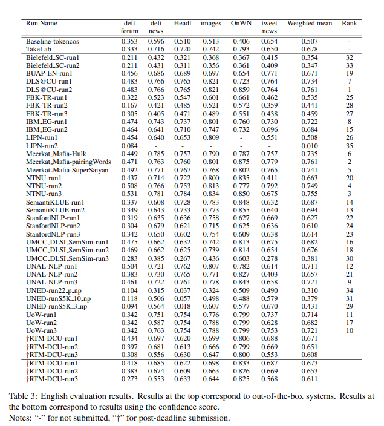

Hi, this is a draft of a post, but it could be already useful.

- The aligner paper: [Back to Basics for Monolingual Alignment: Exploiting Word Similarity and Contextual Evidence (2014)](https://aclanthology.org/Q14-1018.pdf)
- The sentence similarity paper: [DLS@CU: Sentence Similarity from Word Alignment](https://aclanthology.org/S14-2039.pdf)
- [aligner source code](https://github.com/ma-sultan/monolingual-word-aligner)
- State-of-the-art 2014 on sentence word alignment task
- Winner (DSL-CU) of [SemEval 2014 STS (sentence similarity)](https://aclanthology.org/S14-2010.pdf), [results only](https://alt.qcri.org/semeval2014/task10/index.php?id=results)
- [2020 overview of the sentence similarity evolution](https://arxiv.org/pdf/2004.13820.pdf)
 
## The Aligner Algorithm Overview
1. identical word sequences aligner has high precision,
2. align named entities before other content words to enable alignment of entity mentions of different lengths,
3. dependency-based evidence was observed to be more reliable (i.e. of higher precision) than textual evidence in the MSR alignment dev set
4. stop word alignments are dependent on existing content word alignments.

## Identical Word Sequences
This simple heuristic demonstrates a high precision (≈ 97%) on the MSR alignment dev set for n ≥ 2

## Named Entities
- [Stanford Named Entity Recognizer (Finkel et al., 2005)](https://nlp.stanford.edu/software/CRF-NER.html) GNU licence
- Match all first character acronyms

## Content Words
- word similarity: via [Paraphrase Database (PPDB)](https://aclanthology.org/P15-2070.pdf)
- exact word or lemma match, returns similarity score of `1`
- if found as match in the PPDB, returns a similarity score `ppdbSim=0.9`
  - a tuned parameter `0 <= ppdbSim <= 1`

### Dependency-based Alignment Process
- for each potentially alignable pair, the dependency-based context is extracted, and context similarity is calculated as the sum of the word similarities of the context word pairs
  - alignment score a weighted sum of word similarity and contextual similarity
  - then aligns pairs with non-zero evidence in decreasing order of this score (greedy)

Dependency matching is limited by accuracy of the dependency parser.
Custom dependency equivalence lists are used to find similar syntactic patterns.

### Alignment Based on Similarities in The Textual Neighborhood
- extract the context, which is a set of neigh-boring content word pairs
- The contextual similarity is the sum of the similarities of these pairs
- the alignment score is a weighted sum of word similarity and contextual similarity
- The alignment score is then used to make one-to-one word alignment decisions

### Semantic Textual Similarity Score
To say what sentences are similar, we need to calculate a score.
In simple terms the score is harmonic mean of portion of aligned words from one sentence to another for both.

## Datasets

- [MSR Brockett 2007 Corpus (aligned sentences)](https://www.microsoft.com/en-us/research/wp-content/uploads/2016/02/tr-2007-77.pdf)
- 

- [SemEval 2014 STS (sentence similarity)](https://aclanthology.org/S14-2010.pdf),
 

## Results
- state-of-the-art 2014 on word alignment
- Winner of SemEval 2014 STS
 

