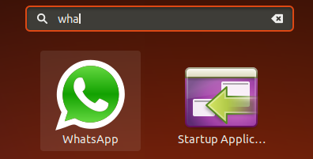
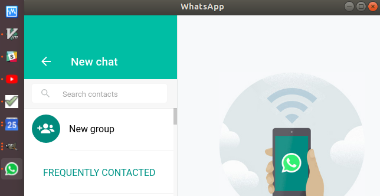

Say you would like to have WhatsApp on Ubuntu as a sandboxed application, but you cannot find any package for that. WhatsApp has a web page, but how to make sure that the page opens as separate application and its provider has no ability to track you on other pages or hack access to your login or history? 

Two step solution below uses Chromium browser. Results are can be overviewed on following pictures:




## Instructions

- Create a desktop file ```whatsapp.desktop``` containing following:
```shell
[Desktop Entry]
Version=1.0
Type=Application
Name=WhatsApp
GenericName=WhatsApp
#Icon=/usr/share/icons/hicolor/scalable/whatsapp.svg
Exec=chromium-browser --class whatsapp -user-data-dir=".config/whatsapp" --app=https://web.whatsapp.com
Terminal=false
```

- Install desktop file executing:
```
sudo desktop-file-install whatsapp.desktop 
```

## Custom Icon
Download and uncomment the Icon line to have icon displayed in Ubuntu search (launcher). However, Chrome will override Taskbar icon with the page icon upon load. This lowers your Taskbar icon resolution, but on the other hand simplifies the process.

Custom Taskbar as well as search (launcher) icons are supported on Firefox.


## Firefox Support 
Firefox has advantage in that it doesn't override your custom icon in the Taskbar, however requires manual profile creation step and manual removal of address bar.
- Replace Exec line with following:
```
Exec=firefox --class whatsapp -P whatsapp https://web.whatsapp.com
```
- Perform manual step of [creating Firefox profile](https://support.mozilla.org/en-US/kb/profile-manager-create-and-remove-firefox-profiles) on first startup.
- Optional: [Remove the tab bar (address bar).](https://superuser.com/questions/1261660/firefox-quantum-ver-57-how-can-i-hide-the-horizontal-tab-bar-with-treesty)

## Others Suggested Apps

- Google Calendar
- Gmail
- Youtube
- Facebook
- Google Tasks

## Desktop File Creator Script

You can speed up the desktop file creation with following script:

```shell
#!/bin/sh -xue

url="$1";
if [ "$#" = "1" ]; then
	name="$(echo "$url" |sed -e 's|https://||;s|http://||;s|\.[^.]\+$||;')";
elif [ "$#" = "2" ]; then
	name="$2";
else
	echo 'Too many arguments. Usage: url [name]';
	exit 1;
fi
cat - > "$name.desktop" <<END
[Desktop Entry]
Version=1.0
Type=Application
Name=$name
GenericName=$name
#Icon=/usr/share/icons/hicolor/scalable/$name.svg
Exec=chromium-browser --class $name -user-data-dir=".config/$name" --app=$url
Terminal=false
END
```

## References

- [https://www.reddit.com/r/linux/comments/7ivuit/create_firefoxbased_web_apps_for_gnome_and/](https://www.reddit.com/r/linux/comments/7ivuit/create_firefoxbased_web_apps_for_gnome_and/)
- [https://superuser.com/questions/1261660/firefox-quantum-ver-57-how-can-i-hide-the-horizontal-tab-bar-with-treesty](https://superuser.com/questions/1261660/firefox-quantum-ver-57-how-can-i-hide-the-horizontal-tab-bar-with-treesty)
- [https://standards.freedesktop.org/desktop-entry-spec/latest/index.html](https://standards.freedesktop.org/desktop-entry-spec/latest/index.html)

