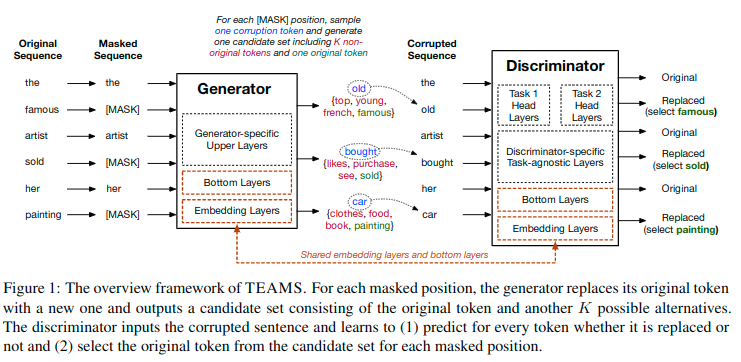



Can you afford to fully train and retrain your own BERT language model?
Training costs is important part of machine learning production as [transformer language models](/ml/transformers-self-attention-mechanism-simplified) get bigger.
ELECTRA model is being adopted by the industry to reduce training expenses. For example [reportedly used in a web search engine Seznam](https://www-root-cz.translate.goog/clanky/rychla-oprava-dotazu-ve-vyhledavaci-pomoci-neuronovych-siti/?_x_tr_sl=cs&_x_tr_tl=en&_x_tr_hl=cs&_x_tr_pto=nui),
which capable to locally compete with Google in the Czech Republic.
ELECTRA is also available on [HuggingFace](https://huggingface.co/transformers/model_doc/electra.html) including a model for pre-training.

## Why Is BERT Training Inefficient?
- [BERT is transformer model](/ml/transformers-self-attention-mechanism-simplified)
- Uses unsupervised pre-training
- Encodes text into WordPiece tokens 
- pre-training task is masked language modeling (MLM) 
  - Pre-training replaces 15% inputs with "[MASK]" token,
  - Then predicts original token ids based on context
- __Every step costs me__,
- But __only a few tokens are masked in each step__!



## BERT vs ELECTRA Training
How to get difficult enough task for all tokens instead of just the tokens masked?
- enter [ELECTRA: Pre-training Text Encoders as Discriminators Rather Than Generators ](https://openreview.net/pdf?id=r1xMH1BtvB)
  - ELECTRA = Efficiently Learning an Encoder that Classifies Token Replacements Accurately
  - Stanford & Google Brain
  - ICRL 2020, Not SoTA
- ELECTRA trains in GAN-like setting:
- trained BERT model is the discriminator
- smaller generator has [transformer architecture](/ml/transformers-self-attention-mechanism-simplified) also
  - Jointly train the generator and discriminator
  - The generator is trained with masked language modeling (MLM) 
  - For each masked position generator samples one token
- The big model discriminates true or fake token
- Not exactly GAN setup: Generator is trained for MLM
 
 

## ELECTRA Model Architecture and Methods
- Generator and discriminator same architecture
  - only embeddings or tokens and positional are shared
  - sharing more was not helping
- Generator 2x - 4x smaller
  - bigger are not helping
  - compute more expensive
  - perhaps bigger too difficult task
- Both trained jointly otherwise discriminator fails to learn
  - otherwise, the discriminator fails to learn
  - generator selects harder cases
  - but must not be too much better than discriminator
- mildly resembles [DINO's momentum teacher-student](https://ai.facebook.com/blog/dino-paws-computer-vision-with-self-supervised-transformers-and-10x-more-efficient-training)
  



## ELECTRA vs BERT vs RoBERTA vs XLNext Performance Results
- Datasets:
  - GLUE: natural understanding benchmark
  - SQuAD: questions answering benchmark
- RoBERTa = BERT with better training and dataset
  - longer training, bigger batches, more data
  - remove next sentence objective
  - train on longer sequences
  - dynamically changing masking pattern
- XLNet = BERT with permutation language modelling
  - maximizes likelihood of the original sequence
  - compared to all other permutations
  - next-token prediction task
- ELECTRA-400K on par with RoBERTa-500K with 4x less FLOPs





## ELECTRA Source of The Improvement
- compared alternative tasks on GLUE score
- results:
  - loss over all inputs is important
  - masking is worse than replacing tokens

<table class="table">
  <thead>
    <tr><th>Task</th><th>Description</th><th>GLUE score</th></tr>
  </thead>
  <tbody>
    <tr><td>BERT</td><td>MLM with [MASK] token</td><td>82.2</td></tr>
    <tr><td>Replace MLM</td><td>masked tokens replaced with generated + LM</td><td>82.4</td></tr>
    <tr><td>Electra 15%</td><td>Discriminator over 15% of the tokens</td><td>82.4</td></tr>
    <tr><td>All-Tokens MLM</td><td>Replace MLM on all tokens + copy mechanism</td><td>84.3</td></tr>
    <tr><td>Electra</td><td>Discriminator over all tokens</td><td>85.0</td></tr>
  </tbody>
</table>

## Personal Speculations:
- ELECTRA could be suitable for low-resource settings
  - Since ELECTRA converges faster
  - perhaps [less data is needed](https://arxiv.org/pdf/2010.08127.pdf)
- ELECTRA training is like augmentation:
  - samples again from generator on each epoch

## Follow up - MC-BERT
- [MC-BERT Paper](https://arxiv.org/pdf/2006.05744.pdf)
- Contrastive instead of discriminative
 

## Follow Up - TEAMS
- also contrastive
- shares more weights

## Read More About BERT
Read more about [BERT, transformer architecture, self-attention, training, and deployment](/ml/transformers-self-attention-mechanism-simplified)