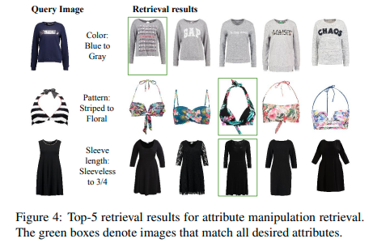
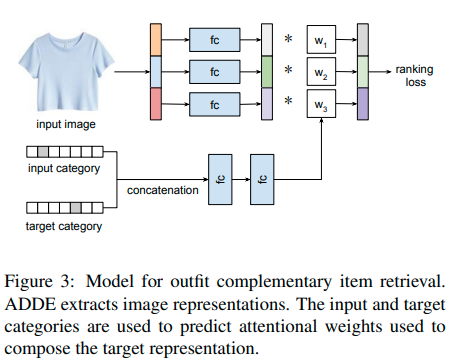



- Tasks:
  - Given a product's image, find the product's different color variant within a dataset.
  - Generate an image of the product but with a flower pattern.
  - Complete this fashion outfit with an additional product.
- What is disentangled representation ([embedding](/ml/Embeddings-in-Machine-Learning-Explained))?
  - Entangled representation = hard to preserve some attributes and change others
  - Disentangled = object's attributes have separate dimensions

## Unsupervised Disentangling Methods
- Below methods are generative
  - so instead of search, can manipulate the image
- Variational Auto-encoders
  - speculation: some disentanglement thanks to the architecture
    - compressing into low-dimension and space close around the zero (regularization term)
    - only high-level factors get through the compression
    - products with similar high level factors are encoded close in the [embedding space](/ml/Embeddings-in-Machine-Learning-Explained)
  - methods: mutual information between latents, total correlation e.g. unsupervised [Relevance factors VAE](https://arxiv.org/pdf/1902.01568v1.pdf)
- GANs (has encoder and decoder) e.g. [DNA-GAN: Learning Disentangled Representations from Multi-Attribute Images](https://arxiv.org/pdf/1711.05415.pdf),
- Flow-Based models e.g. [OpenAI's Glow - Flow-Based Model Teardown](/ml/openais-glow-flow-based-model-teardown)
  - like VAE but the decoder is reverse of the encoder
  - reversibly encodes into independent gaussian factors
  - the attribute vectors are found using labeled data

## Unsupervised Disentangled Representations
- Google ICML 2019 [Challenging Common Assumptions in the Unsupervised Learning of Disentangled Representations](https://ai.googleblog.com/2019/04/evaluating-unsupervised-learning-of.html)
- A large-scale evaluation of various unsupervised methods (12k models)
- On dataset [Shape3D](https://github.com/deepmind/3d-shapes) try to separate all attributes of the scene  
  - into 10 dimensions: object shape, object size, camera rotation, colors
- No model disentangled reliably into above
- Theorem: infinite transformations of the true distribution
  - cannot ever find true dimensions without a guide
  - but could find with additional data?
- Assumptions about the data have to be incorporated into the model (inductive bias)
- Each unsupervised model has to be specialized
 

## Multi-Task Learning
- [Multi-task learning may improve performance](https://ai.googleblog.com/2021/10/deciding-which-tasks-should-train.html)
- Google NeurIPS 2021 paper on a method for grouping tasks
- meta-learning
- usually the tasks have to be related
- inter-task affinity:
  - measure one task's gradient affects the other tasks loss
  - correlates overall model performance

## Supervised-Disentangling: Attribute-driven Disentangled Representations

- Amazon 2021 paper [Learning Attribute-driven Disentangled Representations for Interactive Fashion Retrieval](https://openaccess.thecvf.com/content/ICCV2021/papers/Hou_Learning_Attribute-Driven_Disentangled_Representations_for_Interactive_Fashion_Retrieval_ICCV_2021_paper.pdf)
- SoTA on the fashion tasks (Attribute manipulation retrieval, Conditional similarity retrieval, Outfit completion)
- supervised disentangled representation learning
  - all attribute multiple values
  - split embedding into sections corresponding to attributes
  - multi-task learning allows disentangling
  - store prototype embeddings of each attribute value in memory module
  - prototypes can then be swapped for items attribute vector
- Read more about related research in [image-text classfication](/ml/Multimodal-Image-Text-Classification)

### Architecture

- image representation (AlexNet, Resnet18)
- per attribute:
  - fully-connected two-layer network
  - map into attributed-specific subspace
  - producing image's attribute embedding
- disentangled representation
- called Attribute-Driven Disentangled Encoder (ADDE)
- memory block
  - stores prototype embeddings for all values of the attributes
  - e.g. each color has one prototype embeddings
  - stored in a matrix that forces small non-block diagonal elements
  - trained via triplet loss

### Loss Function
- Label triplet loss
  - representations with same labels to have same vectors
- Consistency triplet loss
  - attribute representations of an image close to corresponding memory vectors
  - align prototype embeddings with representations
- Compositional triplet loss
  - generate change in attributes
  - create manipulation vector using prototype vectors
  - sample positive and negative samples based on labels
- Memory block loss
  - off-block-diagonal to zero

### Experiments and Results

#### Datasets
- Shopping100k: 100k samples, 12 attributes
- DeepFashion: 100k samples, 3 attributes: category, texture, shape

#### Attribute Manipulation Retrieval

- Previous approaches
  - AMNet: [Memory-Augmented Attribute Manipulation Networks for Interactive Fashion Search](https://openaccess.thecvf.com/content_cvpr_2017/papers/Zhao_Memory-Augmented_Attribute_Manipulation_CVPR_2017_paper.pdf)
    - no disentangling
    - target attribute value is represented by a prototype vector 
    - specialized NN layer fuses the prototype vector attribute into the representation
  - FSN: [Learning attribute representations with localization for flexible fashion search](https://openaccess.thecvf.com/content_cvpr_2018/papers/Ak_Learning_Attribute_Representations_CVPR_2018_paper.pdf)
    - localizes regions of attributes within the image
    - using attribute activation maps
    - then weighted-pooling on earlier convolution layer (5 instead of 7)
- AlexNet backbone network for comparable results
- Loss function ablations included

#### Outfit Completion
- backbone network Resnet18
- previous Amazon paper 2020 [Fashion Outfit Complementary Item Retrieval](https://openaccess.thecvf.com/content_CVPR_2020/papers/Lin_Fashion_Outfit_Complementary_Item_Retrieval_CVPR_2020_paper.pdf)
  - introduced CSA-Net with similar architecture without disentanglement

##### Outfit Ranking Loss
  - operates on entire outfit
  - calculates average distance from all members in the outfit to the proposed addition
  - input these distances into a triplet loss

