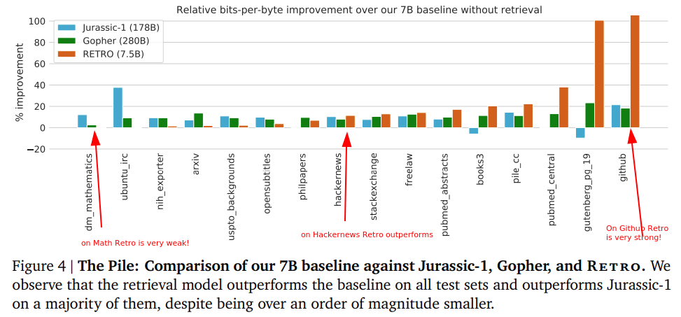



- Retrieval-Enhanced Transformer (RETRO) is autoregressive language model
- from DeepMind's [Improving Language Models by Retrieving from Trillions of Tokens (2021)](https://arxiv.org/pdf/2112.04426v1.pdf), [Deep Mind Blog](https://deepmind.com/research/publications/2021/improving-language-models-by-retrieving-from-trillions-of-tokens)
- conditions on retrieved 2-chunks
- retrieves based on Bert-similarity with preceding chunk
- SoTA on Wikitext103 and the Pile 
- Competitive on QA same perf [GPT-3](https://arxiv.org/pdf/2005.14165.pdf) with 25x less params
- model performs even when low train-test overlap
- retrieval reduces hallucinations and increases interpretability

## Other Retrieval Architectures
- historically inverted index matching [TF-IDF](https://en.wikipedia.org/wiki/Tf%E2%80%93idf) and BM25
- latent topic modelling e.g. [LDA (2003)](https://www.jmlr.org/papers/volume3/blei03a/blei03a.pdf)
- [edit-distance search for translation (2018)](https://arxiv.org/pdf/1705.07267.pdf)
- [kNN-LM (2020)](https://openreview.net/forum?id=HklBjCEKvH)
  - search context LM embedding in database
  - linearly interpolate with LM predictions
- [DPR (2020)](https://aclanthology.org/2020.emnlp-main.550.pdf)
  - trains one [Bert (2017)](https://arxiv.org/pdf/1706.03762.pdf) for keys and one for values
  - uses contrastive loss
- RETRO in contrast uses
  - longer sequences
  - [cross-attention](/ml/cross-attention-in-transformer-architecture) allowing for multiple retrievals
  - bigger database

## Training Dataset
- 10-lingual [MassiveText dataset](https://storage.googleapis.com/deepmind-media/research/language-research/Training%20Gopher.pdf)
- SentencePiece tokenizer vocabulary of 128k tokens
- Retrieval database 1.75T tokens
- 1 token ~ 4 characters ~ 1 word
- Chucks are 64 token sequences
- database ~13B records? 
- not retrieval from the same document during training

 
## Architecture
- Frozen BERT retriever on chunk level
- differentiable encoder conditioned on query
- chunked [cross-attention](/ml/cross-attention-in-transformer-architecture) with previous chunk retrieval set 
- ablations show retrieval helps

## Retriever
- database is key-value memory of chunks
- each value is two consecutive chunks (128 tokens)
- each key is the first chunk from its value (first 64 tokens)
- each key is time-averaged BERT embedding of the first chunk
- key-vectors stored in [ScaNN similarity search](https://github.com/google-research/google-research/tree/master/scann)
- 2T token database queried in 10ms
- retrieval is part of the input dataset pipeline
- optimum number of neighbors between 2 and 40 

## Encoding Retrieved Neighbours
- all retrieved values: 128 consecutive tokens
- are first passed through an encoder
- differentiably modulates retrieved chunks
- using cross attention to query chunks hidden representation
  - at the last layer before first cross-attention
- output is called retrieval set

## Chunked Cross Attention
- take previous chunk retrieval set to be autoregressive
- add relative positional encodings to each retrieved 
- concatenate into time dimension
- use hidden representation at the layer as query
- cross-attend 

## RETRO Results
- SoTA on Wikitext103 and Pile
- on Pile with 7B params outperforms Jurassic-1 and Gopher
  - strongly outperforms on Github - repetitive dataset?
  - weakly outperforms on [HackerNews](https://news.ycombinator.com/)
  - underperforms on Math - not in MassiveText, poor search?
- comparable with GPT-3 when 25x less params
- generates on-topic and coherent text likely thanks to long memories
- underperforms specialized QA models

## How to Use RETRO Ideas
- freeze any pre-trained transformer
- add and train chunked cross-attention and the encoder
- tune number of neighbours between 2 and 40 to your model size
- results should get close to training whole from scratch
- see "Retro-fitting baseline models" section
- Retro source code not published yet
