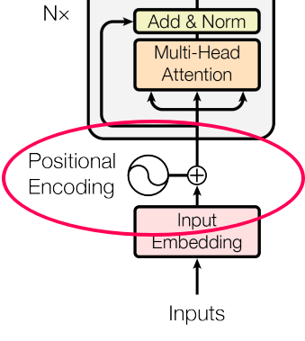



<figure class="figure">
    
    <figcaption class="figure-caption">Each query is multiplied with each key. Then we sum up over corresponding values. So on the output, we get the same sequence length and dimension.</figcaption>
</figure>

The prototypical example of the Transformer architecture is the Bidirectional Encoder Representations from Transformers (BERT) model. The BERT Transformer model was introduced in a [Attention Is All You Need paper](https://arxiv.org/abs/1706.03762).
Transformer's self-attention layer computes differentiable key-value search and summation on the input sequence and [feed forward layer matrix](/ml/Feed-Forward-Self-Attendion-Key-Value-Memory).

- input \\( X \in \mathbf{R}^{L \times d} \\) is a sequence of embeddings of dimension \\( d \\) of length \\( L \\)
- output \\( Y \in \mathbf{R}^{L \times d} \\) has the same shape as input
- project \\( X \\) into 3 matrices of the same shape
  - query \\( X^Q := W^Q X \\),
  - key \\( X^K := W^K X \\)
  - value \\( X^V := W^V X \\)
- calculate "soft sequence-wise nearest neighbor search"
  - "search" all \\( L \times L \\) combinations of sequence elements of \\( X^K \\) and \\( X^Q \\)
  - for each sequence position \\( m \\): output more \\( X^V_{o} \\) when \\( X^K_o \\) is more similar to \\( X^Q_{m} \\)
  - in pseudo-code: \\( Y = \mathrm{matmul}_L(\mathrm{softmax}_L(\mathrm{matmul_d}(X_q, X_k^\intercal)), X_v) \\)
  - in equation: \\( Y = \mathbf{softmax}(QK^\intercal)V \\)
- More details in [Attention Is All You Need paper](https://arxiv.org/abs/1706.03762)

<figure class="figure">
    
    <figcaption class="figure-caption">
        Scaled Dot-Product Attention (<a href="https://arxiv.org/pdf/1706.03762.pdf">source</a>).
    </figcaption>
</figure>

## Positional Embeddings

In BERT, positional embeddings give first few tens of dimensions of the token embeddings meaning of relative positional closeness within the input sequence.
In [Perceiver IO](/ml/cross-attention-in-transformer-architecture#cross-attention-in-perceiver-io) positional embeddings are concatenated to the input embedding sequence instead.
In [SRU++](/ml/SRU++-Speeds-Up-Transformer-with-Simple-Recurrent-Unit-RNN) the positional embeddings are learned feature of the RNN.

### Fourier Positional Encodings in BERT
- Positional embeddings are added to the word embeddings once before the first layer.
- Each position \\( t \\) within the sequence gets different embedding
  - if \\( t = 2i \\) is even then \\( P_{t, j} := \sin (p / 10^{\frac{8i}{d}})  \\)
  - if \\( t = 2i + 1 \\) is odd then \\( P_{t, j} := \cos (p / 10^{\frac{8i}{d}})  \\)
- This is similar to fourier expansion of Diracs delta
- dot product of any two positional encodings decays fast after first 2 nearby words
- most sentences are relatively short ~10 words, thus only first dimensions of positional encodings carry information
- the rest of the embeddings can thus function as word embeddings

## Transformer Training
Transformers are usually pre-trained with self-supervised tasks like masked language modelling or next-token prediction on large datasets.
Pre-trained models are usually very general and publicly distributed e.g. on HuggingFace.
Multiple-GPUs are often used. While there are various approaches to speedup transformer itself, there are also approches to improve its training:
- [ELECTRA training scheme speeds up training](/ml/electra-4x-cheaper-bert-training) with GAN-like setting using a loss over entire sequence.

Then fine-tuning training is used to specialize the model for a specific task on using a small labelled dataset.
For example model like BART are fine-tuned for summarization tasks.
Sometimes we fine-tune twice, as authors did with [BART model equipped with diminishing self-attention to increase summarization coverage](/ml/submodularity-in-ranking-summarization-and-self-attention).

## Self-Attention Computational Complexity
- complexity is quadratic in sequence length \\( O(L^2) \\)
- because we need to calculate \\( L \times L \\) attention matrix \\( \mathbf{softmax}(\frac{QK^\intercal}{\sqrt{d}}) \\)
- but context size is crucial for some tasks e.g. character-level models
- multiple speedup approaches already exits
- for example [Performer](/ml/Performers-FAVOR+-Faster-Transformer-Attention), [Expire-Span](/ml/expire-span-scaling-transformer-by-forgetting), [SRU++](/ml/SRU++-Speeds-Up-Transformer-with-Simple-Recurrent-Unit-RNN) are architectures reducing transformer computational complexity.
  - In [Perceiver IO, cross-attention](/ml/cross-attention-in-transformer-architecture#cross-attention-in-perceiver-io) is used to reduce dimensionality and thus the complexity.

<figure class="figure">
    
    <figcaption class="figure-caption">
        Attention Complexity (<a href="https://arxiv.org/pdf/2009.14794.pdf">source</a>).
    </figcaption>
</figure>

## Cross-Attention

[Cross-attention is used to combine different sequences](/ml/cross-attention-in-transformer-architecture) of different inputs and modalities.
Read more about [what Cross-Attention is and where it is used](/ml/cross-attention-in-transformer-architecture).

## Transformer vs Word2vec Continuous Bag-of-Words

This matches the 
Word2vec Continuous Bag-of-Words predicts word in the middle of the surrounding 2-word context with sum of the context vectors.
Word2vec CBOW model is very similar to a special single layer transformer.
If masked word embedding is denoted \\( v_{\mathrm{mask}} \\) and it has approximately the same cosine similarity to all word vectors.
And if \\( W_K = W_Q = W_V = 1 \\). 

If we use [fourier positional encodings](#fourier-positional-encodings-in-bert) \\( P \\).
Since the positional encodings would select mostly the nearby words, then the Transformer output for a masked word is close to summation of the surrounding word vectors like in CBOW Word2vec.
The result would however be still more expressive, as it would contain [relative and absolute positional terms](https://www.reddit.com/r/MachineLearning/comments/cttefo/d_positional_encoding_in_transformer/exs7d08/),
which are not present in Word2vec.

If we would instead not use positional encodings, and use sliding context size matching Word2vec's, then the results would be even closer to the Word2vec.