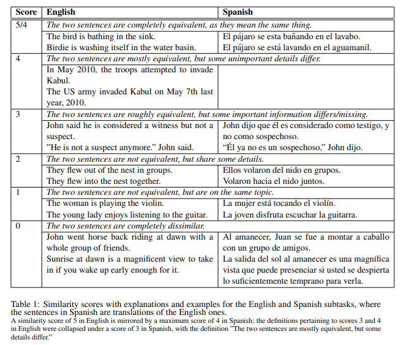
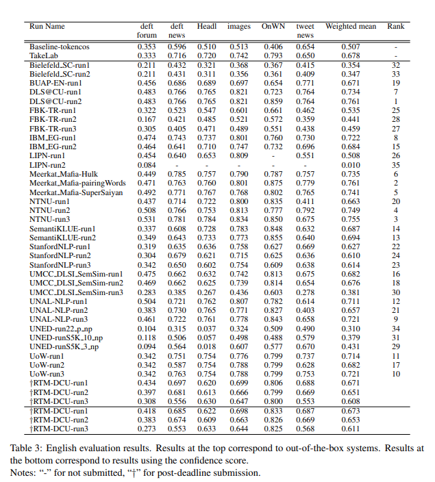



One would expect that in 2015, all sentence similarity task would be dominated by deep machine learning models.
Instead, top scores were occupied by corpus-based word-alignment models that used  simple algorithms together with word databases or word embeddings e.g. word2vec.
This post is about relationship of word alignment and similarity and about a word aligner based solely on dependency parsing and a word database that achieved 1st place in 2014 and 5th in 2015 in SemEval STS.

- The monolingual aligner paper: [Back to Basics for Monolingual Alignment (2014)](https://aclanthology.org/Q14-1018.pdf)
- The aligner-based sentence similarity paper: [DLS@CU](https://aclanthology.org/S14-2039.pdf)
- The aligner source: [Sultan et al. 2014 aligner source code](https://github.com/ma-sultan/monolingual-word-aligner)
- State-of-the-art 2014 on sentence word alignment task
- Winner (DSL-CU) of [SemEval 2014 STS (sentence similarity)](https://aclanthology.org/S14-2010.pdf), [results only](https://alt.qcri.org/semeval2014/task10/index.php?id=results)
- Fifth place in SemEval 2015 STS - [2020 overview of the sentence similarity evolution](https://arxiv.org/pdf/2004.13820.pdf)

## Word Alignment

In word alignment we have two similar sentences and look for a correspondence mapping between the words that correspond to the same meaning within the context.
To evaluate this task we need to have labelled corpus.
Word alignment task is related to [word movers distance (read more)](/ml/Word-Movers-Embedding-Cheap-WMD-For-Documents),
in that both first map between the words, but alignment has to be zero-or-one while in case of WMD we can distribute the word weights in a fuzzy way.

## Word Alignment vs Semantic Similarity
How word alignment relates to semantic similarity?
Semantic similarity increases with similar semantic units of similar semantic contexts in the word alignment.

Now, to say how similar word-aligned sentences are, we need to calculate some score.
The score for similarity of sentence A to sentence B is a fraction of aligned words divided by number of words in sentence A.
This measure is made symmetric by taking harmonic mean of both directions.
Stop word alignment is not used for sentence similarity task.

So, how to align the words?

 
## The Sultan 2014 Aligner Algorithm

In each step below we increasingly align more words: 
1. align identical word sequences (high precision)
1. align named entities before other content words to enable alignment of entity mentions of different lengths
1. align similar words with similar dependency-tree context (higher precision then the next step)
1. align similar word with similar with 3 to the left and 3 to the right
1. align stop words depending on existing content word alignments

### Identical Word Sequences
Aligning identical words in sequences of length `n` containing at least one content word.
This simple heuristic demonstrates a high precision (≈ 97%) on the MSR alignment dev set for `n ≥ 2`

### Named Entities
The algorithm uses GNU licenced [Stanford Named Entity Recognizer (Finkel et al., 2005)](https://nlp.stanford.edu/software/CRF-NER.html) to align all first character acronyms in the texts.

### Content Words
- word similarity: via [Paraphrase Database (PPDB)](https://aclanthology.org/P15-2070.pdf)
- exact word or lemma match, returns similarity score of `1`
- if found as match in the PPDB, returns a similarity score `ppdbSim=0.9`
  - a tuned parameter `0 <= ppdbSim <= 1`

### Dependency-based Alignment Process
- for each potentially alignable pair, the dependency-based context is extracted, and context similarity is calculated as the sum of the word similarities of the context word pairs
- alignment score a weighted sum of word similarity and contextual similarity
- then aligns pairs with non-zero evidence in decreasing order of this score (greedy)

Dependency matching is limited by accuracy of the dependency parser.
Custom dependency equivalence lists are used to find similar syntactic patterns.

### Alignment Based on Similarities in The Textual Neighborhood
- extract the context, which is a set of neigh-boring content word pairs (3 left, 3 right)
- The contextual similarity is the sum of the similarities of these pairs
- the alignment score is a weighted sum of word similarity and contextual similarity
- The alignment score is then used to make one-to-one word alignment decisions

## Datasets

- [MSR Brockett 2007 Corpus (aligned sentences)](https://www.microsoft.com/en-us/research/wp-content/uploads/2016/02/tr-2007-77.pdf):
 

- SemEval 2014 STS [SemEval 2014 STS (sentence similarity)](https://aclanthology.org/S14-2010.pdf):
 

## Results
- state-of-the-art 2014 on word alignment
 

Winner of SemEval 2014 STS [SemEval 2014 STS (sentence similarity)](https://aclanthology.org/S14-2010.pdf):

